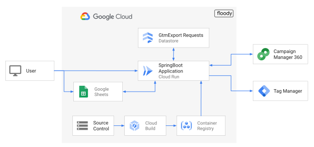

# Floody - Bulk Floodlight management

Managing many Floodlight Activities using the Campaign Manager 360 user interface 
can be time-consuming and tedious. 
Floody makes it possible for you to edit all your Floodlight Activities using a *Single Screen*.

Floody features: (all of the following support bulk operations)
* Create new Floodlight Activities
  * Create linked audience list
* Add/Update Default Tags
* Add/Update Publisher tags
* Export Floodlight Activities to Google Tag Manager
* Share the working sheet with others

Floody Uses Google Sheets to provide you with an easy bulk editing interface, 
the spreedsheet is synced to the Campaign Manager 360 using API, when you click Import/Export.


## Architecture



Floody uses Google Cloud to power-up behind the scenes.
It uses billable components of Google Cloud, including the following:

* [Cloud Run](https://cloud.google.com/run/pricing)
* [Cloud Datastore](https://cloud.google.com/datastore/pricing)
* [Cloud Secret Manager](https://cloud.google.com/secret-manager/pricing)

## Build and Deploy Prerequisites

- Java JDK (version 11)
- [Google Cloud SDK](https://cloud.google.com/sdk)
- Python (2.7 and ≥3.6)

### Before you begin

You need a Google Cloud [project](https://cloud.google.com/resource-manager/docs/cloud-platform-resource-hierarchy#projects).

1. [Create a Google Cloud project](https://console.cloud.google.com/projectselector2/home/dashboard).
1. Make sure that [billing is enabled](https://support.google.com/cloud/answer/6293499#enable-billing) for your Google
   Cloud project.

1. Enable Google APIs required for Floody service:

   ```shell
   gcloud services enable \
   appengine.googleapis.com \
   cloudbuild.googleapis.com \
   cloudscheduler.googleapis.com \
   datastore.googleapis.com \
   dfareporting.googleapis.com \
   drive.googleapis.com \
   run.googleapis.com \
   secretmanager.googleapis.com \
   sheets.googleapis.com \
   tagmanager.googleapis.com
   ```

1. Clone the Github repository

   ```shell
   git clone https://github.com/google/floody && \
   cd floody
   ```
   
1. Use an editor of your choice to update `set_variables.sh` script with values for your project.

1. Set the values as environment variables

   ```shell
   source set_variables.sh
   ```

### Create service accounts

We recommend that you run application with fine-grained access control to 
improve access partitioning. If your project does not have a user-created 
service account, create one using following instructions.

You can use your browser by going to [**Service
accounts**](https://console.cloud.google.com/projectselector/iam-admin/serviceaccounts?supportedpurview=project)
in the Cloud Console.

1. Create a service account to use as the user-managed 
   application service account :
   ```shell
   gcloud iam service-accounts create "${FLOODY_SERVICE_ACCOUNT_NAME}" \
   --project="${PROJECT_ID}" \
   --description="Service Account for Floody service" \
   --display-name="Floody Application service account"
   ```
1. Create a custom role with required permissions for accessing Cloud Secrets 
   and Datastore:
   ```shell
   gcloud iam roles create ${FLOODY_ROLE_NAME} \
   --project=${PROJECT_ID} \
   --file=floodyapp_permissions.yaml
   ```

1. Apply the custom role to the service account:
   ```shell
   gcloud projects add-iam-policy-binding ${PROJECT_ID} \
   --member="serviceAccount:${FLOODY_SERVICE_ACCOUNT_EMAIL}" \
   --role=projects/${PROJECT_ID}/roles/${FLOODY_ROLE_NAME}
   ```

## Create OAuth Client ID Credential

Follow the steps to [Generate OAuth Client Id](https://support.google.com/cloud/answer/6158849?hl=en)
 > If this is your first time creating a OAUth credentials, 
 > you need to configure the OAuth consent screen.

## Store the Client Id in Secret Manager
To ensure that the Client ID is not bundled as part of the code, it is recommended to use Cloud Secret Manager to store it.
Cloud Run allows one to set environment variables based on Secrets to secure such sensitive information.

Create a secret with a secret ID `floody-client-id`:

```shell
gcloud secrets create "floody-client-id" --replication-policy="automatic"
```

Create a secret version with the actual client-id, 
Replace `[client-id]` with the Client ID credential

```shell
echo "[client-id]" | \
gcloud secrets versions add "floody-client-id" --data-file=-
```

## Create Cloud Datastore Instance

Floody uses Cloud Datastore to store GTM export requests.

Create the Datastore database:

```shell
gcloud datastore databases create --region="${REGION_ID}"
```

> Ensure that Cloud Run and Datastore instances are in the same Google Cloud 
> region.

## Build and Deploy Floody application to Cloud Run

### Build container image

   
If you want to use your own build system, you will need use the following steps: 

1. Download latest Bazelisk (or install Bazel 4.1.0):

   ```shell
   wget -q \
   "https://github.com/bazelbuild/bazelisk/releases/latest/download/bazelisk-linux-amd64" && \
   chmod +x bazelisk-linux-amd64
   ```

1. Compile a fat-jar using Bazel:

   ```shell
   bazelisk-linux-amd64 build //server:floodyapp
   ```

### Deploy on App Engine (Standard)

1. Update **`FLOODY_CLIENT_ID`** in `appengine/app.yaml` with the OAuth Client ID generated in the 
   previous step.

1. Create AppEngine app

    ```shell
   gcloud app create --region="${REGION_ID}"
    ```
   
1. Deploy an AppEngine version

    ```shell
   gcloud app deploy --appyaml="appengine/app.yaml" bazel-bin/server/floodyapp.jar 
    ```

1. The AppEngine URL is of format `[project-id].as.r.appspot.com` or `[project-id].appspot.com`.
   Retrieve the AppEngine URL:

    ```shell
   gcloud app describe | grep defaultHostname
    ```

### Deploy Cloud Run service

1. Use Cloud Build to compile the application code and create the container
   image for Cloud Run:

   ```shell
   gcloud builds submit \
   --tag "gcr.io/${PROJECT_ID}/floodyapp" \
   --machine-type=e2-highcpu-32
   ```

   > The Docker script uses [Bazelisk](https://github.com/bazelbuild/bazelisk)
   > to automatically use the Bazel version specified in `.bazelversion` for build


If you are using local build then use the following command to create the Cloud Run container image
from the fat-jar:

   ```shell
   tar --transform="s|LocalBuildCloudRunServiceDockerfile|Dockerfile|" -czf \
   "${TMPDIR:-/tmp}/floodyapp.tgz" \
   LocalBuildCloudRunServiceDockerfile \
   -C bazel-bin/server/ floodyapp.jar && \
   gcloud builds submit "${TMPDIR:-/tmp}/floodyapp.tgz" \
   --tag "gcr.io/${PROJECT_ID}/floodyapp"
   ```

1. Deploy FloodyApp service on Cloud Run using the container image:

   ```shell
   gcloud beta run deploy floodyapp \
   --image=gcr.io/${PROJECT_ID}/floodyapp:latest \
   --project="${PROJECT_ID}" \
   --region="${REGION_ID}" \
   --set-secrets=FLOODY_CLIENT_ID=floody-client-id:latest \
   --service-account="${FLOODY_SERVICE_ACCOUNT_EMAIL}" \
   --allow-unauthenticated \
   --memory=512Mi \
   --platform=managed
   ```
   A service URL will be shown after the command is run successfully.
   A sample output is shown below.

   ```console
   Service URL: https://floody-xxxxxxxxxx-uc.a.run.app
   ```
1. Retrieve he URL in an environment variable:

   ```shell
   export FLOODYAPP_URL="$(gcloud run services describe floodyapp --region=${REGION_ID} | grep URL | sed 's/URL:\s*//')"
   ```

1. Update the Authorized JavaScript origins section of the OAuth Client ID 
   credential with the Service-URL.
   
## Configure Cron tasks

Use Cloud Scheduler to trigger cron task for Floody application.
One of the tasks is to remove unused spreadsheets:

Create a scheduled job:

```shell
gcloud scheduler jobs create http delete-old-sheets \
--schedule="1 0 * * *" \
--time-zone="Etc/UTC" \
--http-method="GET" \
--uri="${FLOODYAPP_URL}/crontasks/removeOldFiles" \
--oidc-service-account-email="${FLOODY_SERVICE_ACCOUNT_EMAIL}"
```

# Build and Run Floody Locally

It is advisable to use a separate Service Account and OAuth Client ID for the 
local development environment. 
Use `http://localhost:8080` as Authorized Javascript origins for the OAuth credential.

## Install Datastore Emulator

Execute the following command to install
the [emulator](https://cloud.google.com/datastore/docs/tools/datastore-emulator)

```shell
gcloud components install cloud-datastore-emulator
```

## Download Service Account Keys

Execute the `gcloud iam service-accounts keys create` command to create service
account keys.

```shell
gcloud iam service-accounts keys create [developer-service-account-key-file] \
    --iam-account="[developer-service-account-email-addredd]"
```

## Update and Export Local Variables

Please update the following variables in `set_variables.sh` found in the root
folder according to your own project settings.

```shell
GOOGLE_APPLICATION_CREDENTIALS="[path-to-the-key-file-for-developer-service-account]"
DATASTORE_EMULATOR_HOST="localhost:8081"
DATASTORE_PROJECT_ID="your-project-id"
EXECUTION_ENVIRONMENT="local"
FLOODY_CLIENT_ID="[the-local-testing-client-id]"
```

Export these variables by executing the following command.

```shell
source set_variables.sh
```

## Starting the Datastore Emulator

Emulator can be started using the command below.

```shell
gcloud beta emulators datastore start --no-store-on-disk
```

The flag `--no-store-on-disk` stores everything in memory so that there is no
need to clean up test data after each run.

## Compile and run local server

Execute the following command to start the local server.

```shell
bazel run //server:floody_complete
```

Floody can now be accessed via http://localhost:8080/.

## License

This is not an official Google product.
Licensed under Apache 2.0
